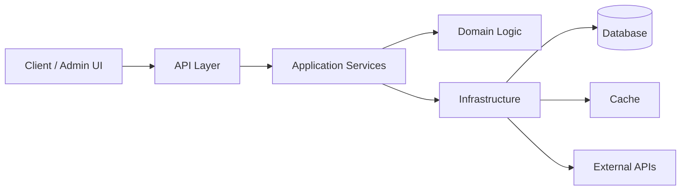

<div align="center">

# Bohdan Suprun

### Backend PHP/Laravel Developer

**APIs • Laravel Packages • CMS Architecture • Infrastructure-minded Systems**

Based in Reykjavík, Iceland.

[Website](https://bohdan.is) · [GitHub](https://github.com/suprun-bohdan)

</div>

---

## What I do

I build backend systems that are clear, maintainable, documented, and ready to grow.

My main focus:

```txt
Laravel Backend Development
API-first Architecture
CMS & Admin Systems
Laravel Package Development
IP / Network Intelligence Tools
Docker & Linux Infrastructure
AI-assisted Developer Tools
```

---

## Core direction

```txt
Clean backend architecture.
Stable APIs.
Readable code.
Practical automation.
Documentation as part of the product.
```

I care about software that can survive real maintenance — not just look good in a demo.

---

## Featured work

### Luma CMS

**AI-native open-source CMS** focused on structured content, clean backend architecture, and developer-first workflows.

```txt
Laravel backend
Structured content engine
Modern admin experience
AI-assisted workflows
API-first design
```

---

### Laravel IP Info

Laravel package for IP intelligence, geolocation, proxy-aware request handling, and network metadata.

```txt
IPv4 / IPv6
Client IP detection
Geolocation
Proxy-aware requests
Laravel-friendly API
```

Repository:
[github.com/suprun-bohdan/laravel-ip-info](https://github.com/suprun-bohdan/laravel-ip-info)

---

### 2ip.is

Concept for an Iceland-focused IP, DNS, geolocation, and network intelligence platform.

```txt
IP lookup
DNS tools
Geolocation
Infrastructure diagnostics
Developer-friendly network utilities
```

---

## Architecture mindset



---

## Tech stack

<p>
  
  
  
  
  
  
  
  
  
</p>

---

## Experience

```txt
2019 — 2021   City Council Vashkivtsi   Software Engineer
2021 — 2022   AlterEgo                  Backend Engineer
2022 — 2024   SapientPro                Backend Engineer
2024 — 2025   WTG                       Backend Engineer
```

Currently based in Iceland and building open-source backend tools, Laravel packages, and product experiments.

---

## How I think about engineering

```txt
clarity over cleverness
stable contracts over hidden magic
small core, replaceable adapters
boring APIs over fragile abstractions
tests before confidence
ship real things
```

---

## Useful links

```txt
Website:  https://bohdan.is
GitHub:   https://github.com/suprun-bohdan
Location: Reykjavík, Iceland
```

---

<div align="center">

### Backend developer focused on Laravel, infrastructure, and practical open-source products.

</div>
