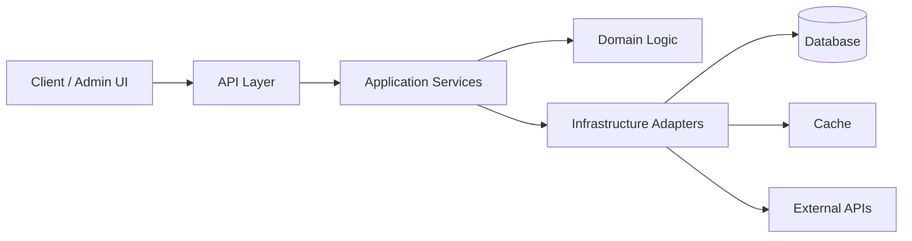
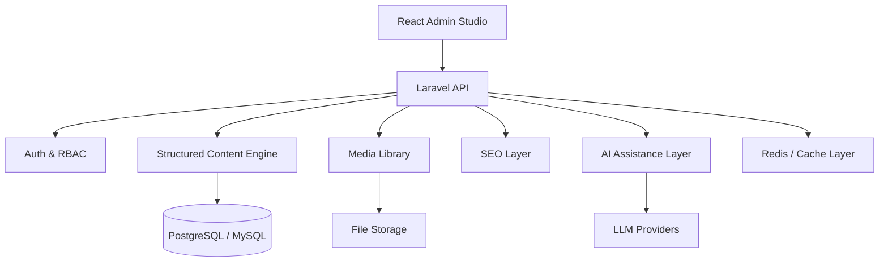

# Bohdan Suprun

**Backend PHP/Laravel Developer** based in Reykjavík, Iceland.

I build backend systems, Laravel packages, API-first products, self-hosted infrastructure, and AI-native developer tools.

My main focus is simple: **clear architecture, stable APIs, maintainable code, and products that can actually be shipped.**

---

## Focus

```txt
Backend Engineering
Laravel Package Development
API Architecture
CMS Architecture
IP / Network Intelligence
Docker-based Infrastructure
AI-native Developer Tools
```

---

## Currently building

### Luma CMS

**Luma CMS** is my open-source AI-native CMS concept focused on structured content, modern developer experience, Laravel backend architecture, and clean admin workflows.

```txt
Goal:
A modern CMS that feels like a serious developer platform,
not another overloaded WordPress clone.
```

Planned direction:

* Laravel backend
* React / TypeScript admin interface
* API-first architecture
* PostgreSQL / MySQL support
* Modular content engine
* Media library
* Roles and permissions
* SEO layer
* AI-assisted content workflows

---

### Laravel IP Info

**Laravel IP Info** is a Laravel package for IP intelligence, request IP detection, geolocation, proxy-aware handling, and network metadata.

Main ideas:

* IPv4 and IPv6 support
* Real client IP detection
* Proxy-aware request handling
* Local database support
* Geolocation provider abstraction
* ASN / ISP / country metadata
* Laravel-friendly API
* Clean package architecture

Repository:

```txt
https://github.com/suprun-bohdan/laravel-ip-info
```

---

### 2ip.is concept

**2ip.is** is a concept for an Iceland-focused IP, DNS, geolocation, and network intelligence platform.

The idea is to build a practical tool for:

* IP lookup
* IPv4 / IPv6 detection
* DNS checks
* Geolocation
* ISP metadata
* Proxy / VPN signals
* Developer-friendly network diagnostics

Website:

```txt
https://bohdan.is
```

---

## System design focus



---

## Luma CMS architecture direction



---

## Engineering principles

```txt
clarity over cleverness
explicit contracts over hidden magic
boring APIs over fragile abstractions
tests before confidence
documentation as part of the product
small core, replaceable adapters
```

I prefer systems that are easy to understand, easy to test, and safe to change.

Good software is not just code that works today.
Good software is code that can survive maintenance, growth, bugs, refactoring, and real users.

---

## Tech stack

### Backend


### Databases


### Frontend


### Infrastructure


---

## Repository standards I care about

Every serious repository should have more than just code.

```txt
README
documentation
tests
static analysis
CI pipeline
license
changelog
examples
clear public API
```

For Laravel packages, I care about:

* clean service providers
* explicit configuration
* contracts and DTOs where they make sense
* predictable public API
* framework-friendly defaults
* testable internals
* semantic versioning
* documentation before release

---

## Software experience

| Period      | Organization            | Role              |
| ----------- | ----------------------- | ----------------- |
| 2019 — 2021 | City Council Vashkivtsi | Software Engineer |
| 2021 — 2022 | AlterEgo                | Backend Engineer  |
| 2022 — 2024 | SapientPro              | Backend Engineer  |
| 2024 — 2025 | WTG                     | Backend Engineer  |

---

## Current work

I am based in Reykjavík, Iceland.

Currently I work in an educational environment while continuing to build open-source backend tools, Laravel packages, product experiments, and infrastructure-oriented systems.

This combination gives me a practical view of software: technology should not exist only for business dashboards — it should also help people, education, automation, learning, and everyday systems.

---

## What I like to build

```txt
Laravel packages
CMS platforms
Developer tools
Internal systems
Self-hosted services
API-first applications
Network / IP intelligence tools
AI-assisted workflows
```

I am especially interested in the intersection of:

```txt
backend architecture
automation
AI tools
open-source software
infrastructure
education
scientific thinking
```

---

## Featured projects

### Luma CMS

Modern AI-native CMS concept with Laravel backend, structured content architecture, and developer-first design.

```txt
Status: active concept / early development
Focus: CMS architecture, AI workflows, content modeling
```

---

### Laravel IP Info

Laravel package for IP intelligence, geolocation, proxy-aware client IP detection, and network metadata.

```txt
Status: package development
Focus: Laravel, IP tools, geolocation, request intelligence
```

Repository:

```txt
https://github.com/suprun-bohdan/laravel-ip-info
```

---

### Personal website

My personal website and portfolio.

```txt
https://bohdan.is
```

---

## GitHub activity


---

## Contact

```txt
Website:  https://bohdan.is
GitHub:   https://github.com/suprun-bohdan
Location: Reykjavík, Iceland
```

---

## Short version

```txt
Backend developer.
Laravel-focused.
Infrastructure-minded.
Open-source oriented.
Building Luma CMS, Laravel IP Info, and practical developer tools.
```
